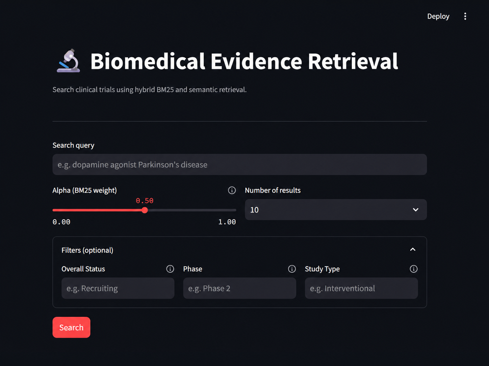
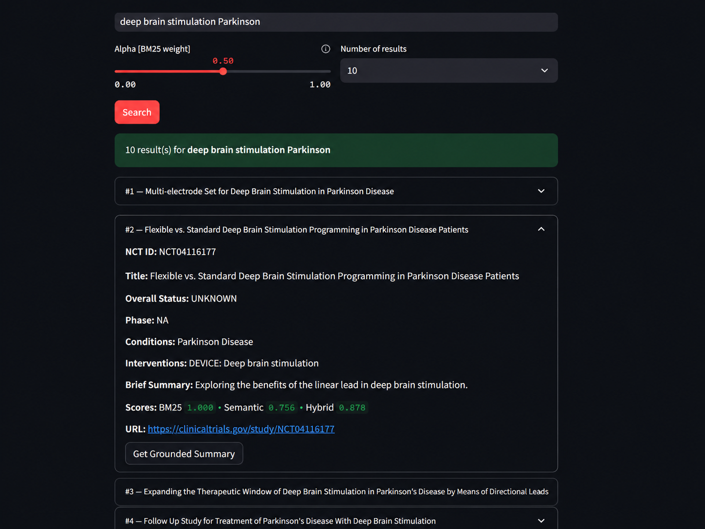
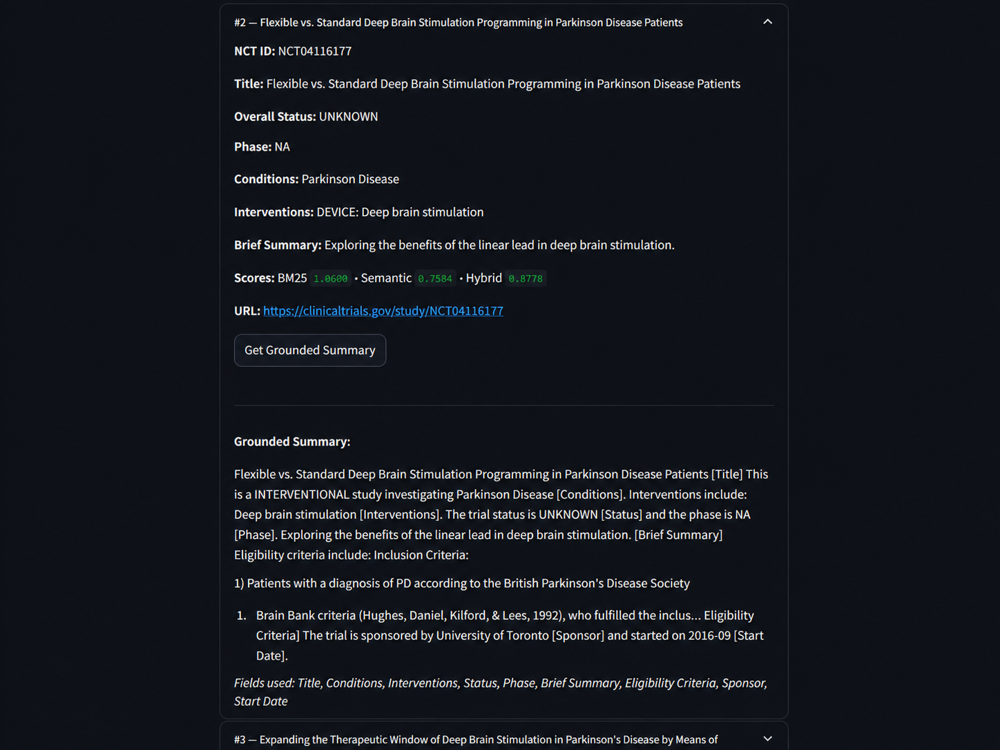
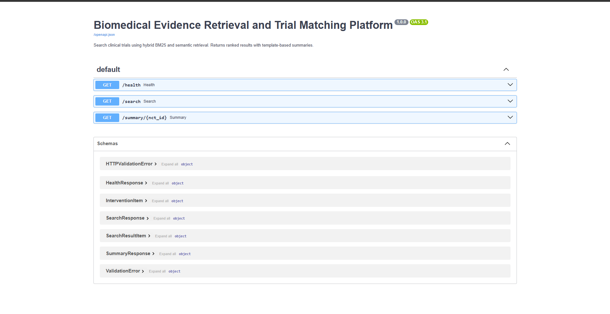
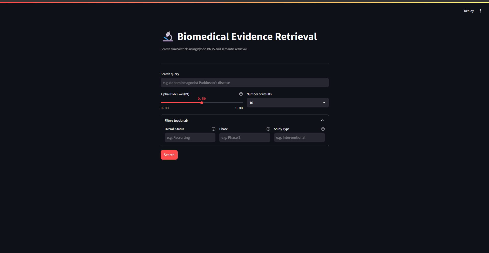

# Biomedical Evidence Retrieval and Trial Matching Platform

A portfolio project that lets you search clinical trial records using a hybrid retrieval pipeline combining BM25 and semantic similarity, with a FastAPI backend and a Streamlit frontend.

---

## Overview

This platform indexes clinical trials from [ClinicalTrials.gov](https://clinicaltrials.gov) into a local SQLite database and provides keyword-based and semantic search over trial records. Results are ranked using a configurable hybrid score. A simple template-based summary is generated for each trial on request. Results can be narrowed using optional filters for status, phase, and study type.

---

## V1 Scope

- **Data source:** ClinicalTrials.gov (V2 API, condition filter: Parkinson disease)
- **Storage:** SQLite
- **Retrieval:** BM25 (via `rank-bm25`) + semantic similarity (via `sentence-transformers`)
- **Scoring:** Hybrid score = `alpha * bm25_score + (1 - alpha) * semantic_score`
- **Backend:** FastAPI with three endpoints: `/health`, `/search`, `/summary/{nct_id}`
- **Frontend:** Streamlit single-page search UI
- **Summaries:** Template-based only — no LLMs, no external calls
- **Tests:** pytest unit tests for retrieval, scoring, summaries, and API routes
- **Evaluation:** Precision@5 and Hit@5 over a manually curated query set

---

## V2.1 — Filtered Search

- **`/search` optional filters:** `overall_status`, `phase`, and `study_type` query parameters added. Filters use case-insensitive exact matching and are applied after hybrid scoring. Omitting a filter returns all results as before.
- **Streamlit UI filters:** An expandable "Filters (optional)" section in the UI exposes all three filter fields as free-text inputs. Filters are passed to the API only when non-empty; leaving them blank preserves the existing search behaviour.
- **Study Type in results:** Each result card in the Streamlit UI now displays Study Type alongside Status and Phase.
- **Retrieval unchanged:** BM25 + semantic + hybrid scoring pipeline is identical to V1.
- **Tests:** All 25 tests pass. Filter tests mock the retrieval layer so they run without requiring built indexes.

---

## V2.2 — Evaluation Benchmark

- **Evaluation query set expanded** to 14 realistic Parkinson disease search queries covering five categories: `treatment`, `device`, `rehabilitation`, `symptoms`, and `gait_freezing`.
- **Metrics reported:** Precision@5, Hit@5, Recall@10, and MRR (Mean Reciprocal Rank).
- **Relevance labels** are candidate-based manual labels produced by reviewing the top-10 results per query at alpha=0.5. They are not a definitive clinical benchmark and should be treated accordingly.
- **Hybrid alpha=0.5 performed best overall** across all four metrics.

### Benchmark Results

| Method | Precision@5 | Hit@5 | Recall@10 | MRR |
|---|---:|---:|---:|---:|
| BM25-only alpha=1.0 | 0.757 | 0.929 | 0.765 | 0.817 |
| Semantic-only alpha=0.0 | 0.671 | 1.000 | 0.620 | 0.821 |
| Hybrid alpha=0.5 | 0.886 | 1.000 | 1.000 | 0.907 |

---

## V2.3 — Biomedical Embedding Comparison

- **Added a standalone biomedical embedding workflow** using `FremyCompany/BioLORD-2023`, a model trained on biomedical and clinical text. Embeddings are saved to `indexes/biomedical_embeddings.npy` with a JSON index at `indexes/biomedical_embedding_index.json`, separate from the general embeddings workflow.
- **Added `biomedical_semantic_retriever.py`** — a standalone retriever that loads the BioLORD embeddings and JSON index without touching the existing `semantic_retriever.py` or the database `embedding_index` table.
- **Added `compare_retrievers.py`** — a standalone script that runs all four methods directly against `eval/queries.json` and prints a benchmark table.
- **Biomedical embeddings did not improve retrieval** on this candidate-based benchmark. BioLORD scored lower than the general model across all metrics, likely because the relevance labels were derived from general-model candidates and the trial corpus is short search-text rather than full clinical prose.
- **The project keeps the existing standard semantic model** (`all-MiniLM-L6-v2`) as the default for now.

### Benchmark Results

| Method | Precision@5 | Hit@5 | Recall@10 | MRR |
|---|---:|---:|---:|---:|
| BM25-only | 0.757 | 0.929 | 0.765 | 0.817 |
| Semantic standard | 0.671 | 1.000 | 0.620 | 0.821 |
| Semantic biomedical | 0.243 | 0.643 | 0.241 | 0.465 |
| Hybrid standard | 0.886 | 1.000 | 1.000 | 0.907 |

---

## Project Structure

```
biomedical-evidence-retrieval/
├── data/raw/                  # Downloaded JSON pages (git-ignored)
├── db/                        # SQLite database (git-ignored)
├── indexes/                   # BM25 index and embeddings (git-ignored)
├── scripts/
│   ├── download.py            # Download raw trial data
│   ├── ingest.py              # Parse and load into SQLite
│   ├── build_bm25_index.py    # Build BM25 index
│   ├── build_embeddings.py    # Build sentence embeddings
│   └── build_biomedical_embeddings.py  # Build BioLORD embeddings (V2.3)
├── app/
│   ├── db.py                  # Database access layer
│   ├── models.py              # TrialRecord and SearchResult dataclasses
│   ├── retrieval/
│   │   ├── bm25_retriever.py
│   │   ├── semantic_retriever.py
│   │   ├── hybrid_scorer.py
│   │   └── biomedical_semantic_retriever.py  # BioLORD retriever (V2.3)
│   ├── summary/
│   │   └── template_summary.py
│   └── api/
│       ├── main.py            # FastAPI app entry point
│       └── routes.py          # API route definitions
├── ui/
│   └── streamlit_app.py       # Streamlit frontend
├── eval/
│   ├── queries.json           # Curated evaluation queries
│   ├── candidates_alpha_0_5.json  # Top-10 candidates used for relevance labelling
│   ├── evaluate.py            # Evaluation script
│   └── compare_retrievers.py  # Retriever comparison script (V2.3)
├── tests/
│   ├── test_bm25_retriever.py
│   ├── test_semantic_retriever.py
│   ├── test_hybrid_scorer.py
│   ├── test_template_summary.py
│   ├── test_api_routes.py
│   └── test_main.py
├── requirements.txt
└── README.md
```

---

## Setup

```bash
# 1. Clone the repository
git clone <repo-url>
cd biomedical-evidence-retrieval

# 2. Create and activate a virtual environment
python -m venv .venv
source .venv/bin/activate        # Windows: .venv\Scripts\activate

# 3. Install dependencies
pip install -r requirements.txt
```

---

## Run Order

Run these steps once to set up the data and indexes before starting the application.

```bash
# Step 1: Download raw trial data from ClinicalTrials.gov
python -m scripts.download

# Step 2: Parse and load trials into SQLite
python -m scripts.ingest

# Step 3: Build the BM25 index
python -m scripts.build_bm25_index

# Step 4: Build sentence embeddings (slowest step; runtime depends on dataset size and machine speed)
python -m scripts.build_embeddings

# Step 5: Start the FastAPI backend (keep this terminal open)
python -m uvicorn app.api.main:app --reload

# Step 6: Start the Streamlit frontend in a second terminal
python -m streamlit run ui/streamlit_app.py
```

- FastAPI interactive docs: [http://localhost:8000/docs](http://localhost:8000/docs)
- Streamlit app: [http://localhost:8501](http://localhost:8501)

---

## Screenshots


*Streamlit search interface*


*Search results with hybrid scores*


*Grounded summary view*


*FastAPI interactive API docs*


*Filtered search with optional status, phase, and study type filters.*

---

## Example Queries

These queries work well against the Parkinson disease trial dataset:

- `levodopa motor fluctuations Parkinson disease`
- `deep brain stimulation subthalamic nucleus`
- `dopamine agonist monotherapy early Parkinson`
- `alpha-synuclein immunotherapy clinical trial`
- `exercise rehabilitation gait freezing Parkinson`

Use the `alpha` slider in the Streamlit UI to adjust the balance between BM25 and semantic retrieval. `alpha=1.0` is BM25-only; `alpha=0.0` is semantic-only; `alpha=0.5` is balanced.

To narrow results, expand the "Filters (optional)" section and enter a value for Overall Status (e.g. `Recruiting`), Phase (e.g. `Phase 2`), or Study Type (e.g. `Interventional`). Leave any field blank to skip that filter.

---

## Evaluation

The evaluation script measures retrieval quality over 14 manually curated queries defined in `eval/queries.json`.

```bash
# Evaluate with default alpha=0.5
python -m eval.evaluate --alpha 0.5

# Evaluate with BM25-only
python -m eval.evaluate --alpha 1.0

# Evaluate with semantic-only
python -m eval.evaluate --alpha 0.0
```

Metrics reported per query:

- **Precision@5** — fraction of the top 5 results that are relevant
- **Hit@5** — whether at least one relevant result appears in the top 5
- **Recall@10** — fraction of all relevant results recovered in the top 10
- **MRR** — reciprocal rank of the first relevant result

> The API must be running before you run the evaluation script.

---

## Limitations

- Data is limited to trials matching a single condition filter (Parkinson disease) from ClinicalTrials.gov.
- The embedding model (`all-MiniLM-L6-v2`) is a general-purpose model, not specialised for biomedical text.
- Summaries are template-based and only include fields present in the database — no language generation.
- Evaluation relevance labels are manually assigned by reviewing retrieved candidates; they are not a definitive clinical benchmark and should be reviewed and expanded before using the metrics as a rigorous benchmark.
- No authentication, no cloud deployment, no persistent user sessions.

---

## Future Improvements

- Add PubMed as a second data source and merge results across sources.
- Replace the general embedding model with a biomedical-domain model such as `BioLORD` or `PubMedBERT`.
- Add LLM-based abstractive summaries as an optional V2 feature.
- Add FAISS for faster approximate nearest-neighbour search at scale.
- Add GitHub Actions for automated testing on push.
- Add Docker for reproducible deployment.
- Expand the evaluation query set with real relevance judgements.
